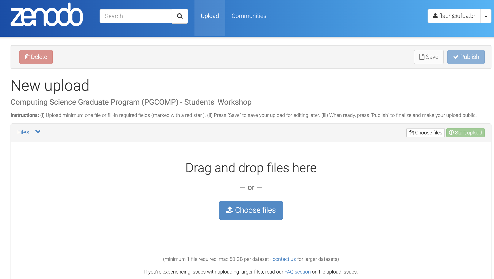
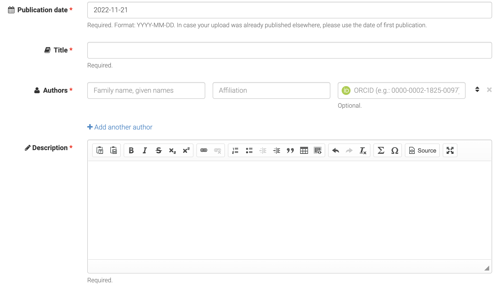

 
## Preparação da apresentação

### Template para slides

O template para slides do WEPGCOMP está disponível 
[aqui](https://docs.google.com/presentation/d/1-xGEu3hvVRVtdjE9yt9DTNlooDm4DqFimnPJMXETWQ8/edit?usp=sharing).
Faça uma cópia, renomeie para `wepgcomp23-seunome-sobrenome`, 
e adicione os seus slides. 
Os dois primeiros slides do template (“Título do trabalho” e “Ficha do trabalho”)  
e o slide sobre “Estágio atual da pesquisa” são _obrigatórios_.
 
#### Depósito de slides no Zenodo

Os autores devem depositar no Zenodo, até **20/11/2023, 23:59h (BRT)**, 
um arquivo (formato PDF) com a versão final dos slides da apresentação.
O nome do arquivo deve ser `wepgcomp23-nome-sobrenome.pdf`.

[Link para upload na comunidade do WEPGCOMP no Zenodo](https://zenodo.org/deposit/new?c=wepgcomp2023).

- Os organizadores do WEPGCOMP 2023 farão a coleta dos slides depositados no Zenodo no dia 21/11 e os disponibilizarão para os coordenadores de sessão.

### Apresentação de trabalhos

- O WEPGCOMP 2023 será presencial e, em casos excepcionais, apresentações poderão ser remotas.

- Os slides usados na apresentação são os que estiverem depositados no Zenodo. Não haverá mudança de computador entre as apresentações.

-  Cada apresentação não deve ultrapassar os 10 minutos de duração. Na sequência da apresentação, os avaliadores terão 5 minutos para perguntas e sugestões.
<!-- Perguntas adicionais via chat do YouTube serão encaminhadas para o apresentador.
-->

- O controle de tempo da apresentação será rigoroso: **10 minutos para apresentação oral** e **5 minutos para perguntas**. 

- Em caso de problemas técnicos, a apresentação será reagendada para o final da sessão ou para a sessão seguinte.

#### Boas Práticas para o(a) Apresentador(a)

- Estar presente e entrar em contato com o/a coordenadora da sua sessão **antes do início da sessão em que fará a sua apresentação**. 
  
- No caso de apresentação remota, testar a câmera e o microfone de seu computador ou smartphone, e sua conexão com a Internet, 
ao menos **30 minutos antes do início da sua sessão**. Em caso de problemas, entrar em contato com a coordenação da sessão 
(a ser divulgada na página do evento). Recomenda-se o uso de _headset_ para diminuir a interferência de sons externos durante a apresentação. 

---

## Depósito no Zenodo

1. Acesse a URL para upload do arquivo com slides em formato PDF:
https://zenodo.org/deposit/new?c=wepgcomp2023

<!--  -->

2. Após a escolha do arquivo ("choose files"), clique em "Start upload".

3. Marque o tipo do upload ("Presentation").

4. Informe data da submissão, título da apresentação, seu nome e resumo enviado ao PGCOMP (informações em inglês poderão dar maior visibilidade ao trabalho).

<!--  -->

A comissão organizadora é responsável pela curadoria dos slides depositado no Zenodo. Em caso de problemas, um novo depósito de slides no Zenodo serásolicitado.

